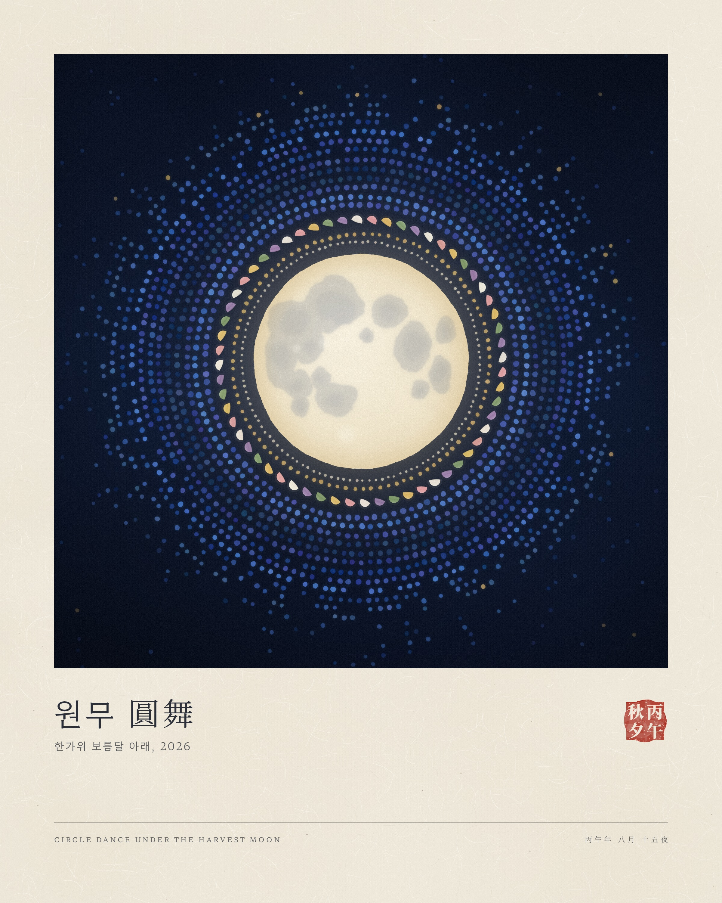

# 원무 圓舞 · 한가위 2026

보름달을 둘러싼 강강술래를 점과 반달로 그린 제너러티브 작품입니다.



## 구성

- **보름달**: 한지를 찢어 붙인 듯한 가장자리와 섬유 질감. 달의 바다는 실제 위치대로 배치해 방아 찧는 옥토끼가 보이도록 했습니다.
- **오색 송편 고리**: 반달 모양 송편(흰색, 분홍, 노랑, 쑥, 보라)이 보름달을 둘러싸고 돌며 강강술래를 춥니다.
- **푸른 점의 우주**: 김환기 전면점화에 대한 오마주. 손으로 찍어 번진 듯한 점들이 동심원을 이루다 밤하늘로 흩어집니다.
- **낙관**: 丙午秋夕 (병오년 추석).

## 파일

| 파일 | 용도 |
| --- | --- |
| `output/chuseok-2026-poster.jpg` | 2400×3000 (4:5), 한지 여백과 캡션이 있는 갤러리 프린트 |
| `output/chuseok-2026-art.jpg` | 2400×2400 정사각, 여백 없는 원화 (프로필, 공유용) |
| `index.html` | 생성기. 브라우저로 열면 바로 렌더링됩니다 |
| `render.cjs` | 헤드리스 Chromium으로 JPG/PNG 출력 |
| `fonts.css` | Hahmlet, Noto Serif KR 글리프 서브셋 (SIL Open Font License) |

## 다시 렌더링

```sh
node render.cjs                 # output/ 에 poster, art JPG 생성
node render.cjs --png           # PNG도 함께 생성 (약 13~16 MB)
node render.cjs --out=/tmp/x alt:mode=art&seed=815&size=3600
```

쿼리 파라미터: `mode=poster|art`, `size=<가로 px>`, `seed=<정수>` (기본 925). 같은 seed면 poster와 art의 그림이 동일합니다.
